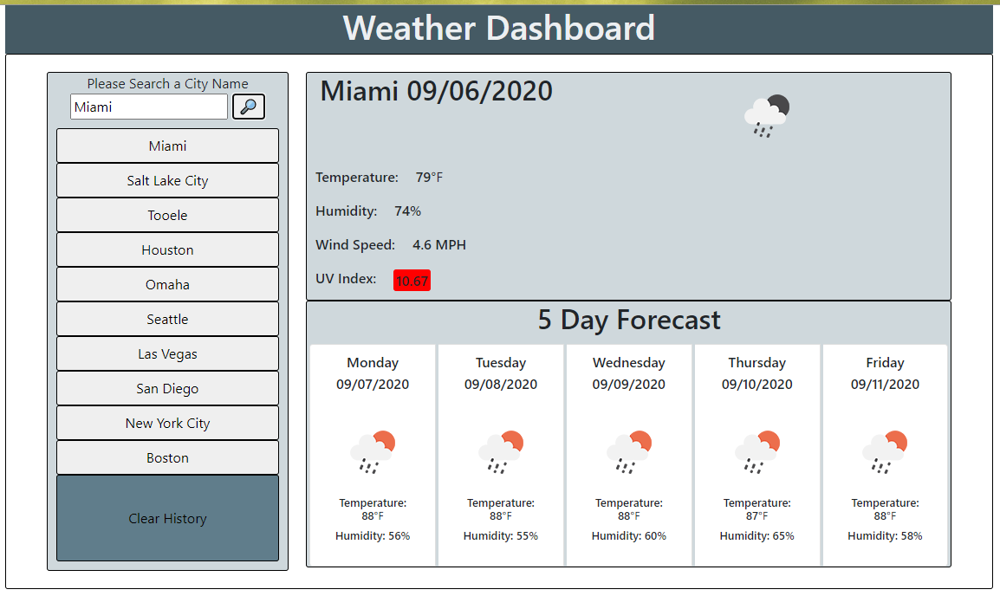

# weather-app
## Project Description
This project was created to allow a user to view simple weather data for a specific city.  The project will also allow you to click on previous city names and view updated details.  You are also able to clear previous search results by clicking the clear history button. This project uses the OpenWeather API, and is limited to 60 calls per minute.

## Languages / Packages Used
* HTML
* CSS
* Bootstrap
* JavaScript
* jquery
* moment.js

## Live Link
https://jacobwilde378.github.io/weather-app/

## Sreenshot / Sample Images
</img>
